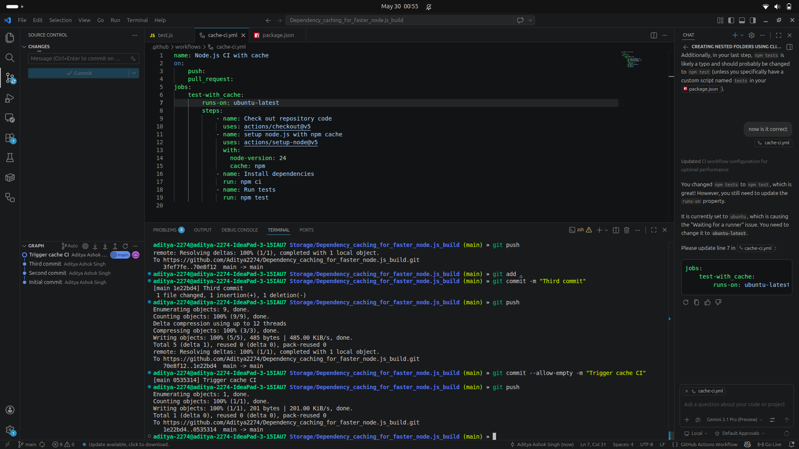

1. What is the purpose of this workflow?

To automatically install dependencies and run tests whenever code is pushed or a pull request is created, while using dependency caching to reduce build time.

2. Which trigger is used and why?
push
pull_request

Because we want CI to run whenever new code is pushed or reviewed through a pull request.

3. Which runner is used?
ubuntu-latest

GitHub-hosted Ubuntu runner.

4. What are the key steps?
Checkout code
↓
Setup Node.js
↓
Restore npm cache
↓
Install dependencies
↓
Run tests
5. What common error can occur?
Missing package-lock.json

Then:

npm ci

may fail because it requires a lock file.

_Note_:GitHub Actions runners are temporary. Dependency caching stores downloaded npm packages between workflow runs so future builds do not need to download everything again.